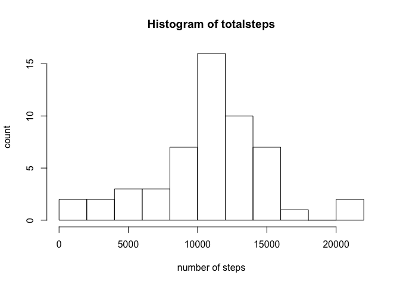
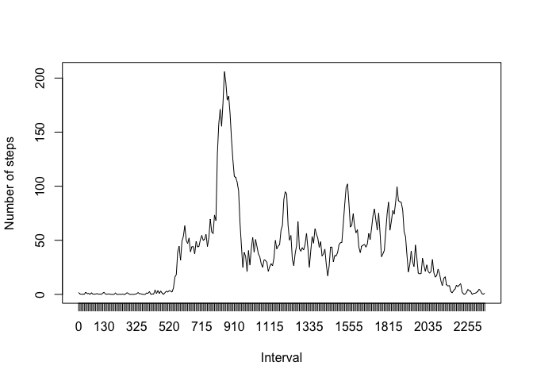
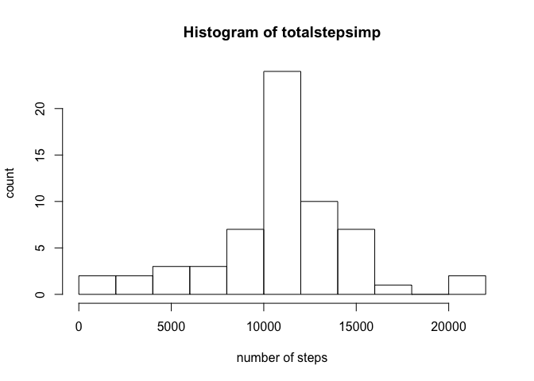
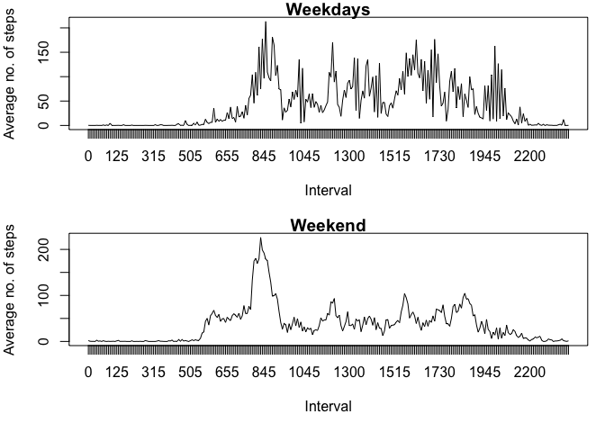

# Loading and preprocessing the data


```r
setwd("~/R/Course5")
df<-read.csv("activity.csv")
str(df)
```

```
## 'data.frame':	17568 obs. of  3 variables:
##  $ steps   : int  NA NA NA NA NA NA NA NA NA NA ...
##  $ date    : Factor w/ 61 levels "2012-10-01","2012-10-02",..: 1 1 1 1 1 1 1 1 1 1 ...
##  $ interval: int  0 5 10 15 20 25 30 35 40 45 ...
```

No further processing of the data is needed - NAs will be dealt with and Date is
in factor format.

# What is mean total number of steps taken per day?


```r
totalsteps<-tapply(df$steps,df$date, sum)
hist(totalsteps, breaks=15, xlab = "number of steps", ylab="count")
```

<!-- -->

This histogram shows distribution of the number of steps taken

```r
meantotal<-as.character(round(mean(totalsteps, na.rm = TRUE), digits=2))
mediantotal<-median(totalsteps, na.rm = TRUE)
```
The mean number of steps taken is 10766.19. 
The median number of steps taken is 10765.

#What is the average daily activity pattern?
Here is a plot of the average number of steps taken per interval.

```r
df2<-na.omit(df)
avsteps<-tapply(df2$steps,df2$interval, mean)
xnames<-names(avsteps)
plot(avsteps, type="l", xaxt="n", ylab="Number of steps", xlab="Interval")
axis(1, at=1:length(xnames), labels = xnames)
```

<!-- -->

```r
max<-names(which.max(avsteps))
```
 835 is the interval with the maximum number of steps.
 
#Imputing missing values
calculate the number of missing values:


```r
 totalmissingvalues<-sum(is.na(df))
```
 
 The total number of missing values is 2304
 
 A strategy to create a new dataset with imputed values is using the
 mean of each interval and the functions ddply and impute. Here is the
 creation of the dataset with imputed values:


```r
library(Hmisc)
```

```
## Warning: package 'Hmisc' was built under R version 3.4.3
```

```r
library(plyr)
df3<-ddply(df, "interval", mutate, imputed.value=impute(steps, mean))
df3$steps<-df3$imputed.value
df3<-df3[,1:3]
```

This code calculates the new mean and median of the dataset with imputed values.


```r
totalstepsimp<-tapply(df3$steps,df3$date, sum)
meantotalimp<-as.character(round(mean(totalstepsimp), digits=2))
mediantotalimp<-as.character(round(median(totalstepsimp), digits=2))
```

Here is a histogram of the distribution of the number of steps taken with 
imputed data


```r
hist(totalstepsimp, breaks=15, xlab = "number of steps", ylab="count")
```

<!-- -->

The new mean number of steps is 10766.19
The new median number of steps is 10766.19
The mean is not changes by imputing, the median is slightly shifted.

#Are there differences in activity patterns between weekdays and weekends?
create a new variable indicating the week- and weekend days. The days are in
Dutch. The data.frame with imupted values (df3) is used.

```r
df3$weekday<-weekdays(as.Date(df3$date))
```

```
## Warning in strptime(xx, f <- "%Y-%m-%d", tz = "GMT"): unknown timezone
## 'zone/tz/2018c.1.0/zoneinfo/Europe/Amsterdam'
```

```r
df3$weekday<-ifelse(df3$weekday==c("zaterdag", "zondag"), "weekend", "weekday")
df3$weekday<-as.factor(df3$weekday)
```

This code calculates the mean number of steps per interval for week and weekend
days separately:

```r
dfweek<-df3[df3$weekday=="weekend",]
dfweekend<-df3[df3$weekday=="weekday",]
avstepsweek<-tapply(dfweek$steps,dfweek$interval, mean)
avstepsweekend<-tapply(dfweekend$steps,dfweekend$interval, mean)
```

This is the plot of the mean number of steps per interval for week and weekend
days:

```r
par(mfrow=c(2,1), mar=c(5,4,1,1))
plot(avstepsweek, type="l", xaxt="n", xlab="Interval", ylab="Average no. of steps", main="Weekdays")
xnames1<-names(avstepsweek)
axis(1, at=1:length(xnames1), labels = xnames)
plot(avstepsweekend, type="l", xaxt="n", xlab="Interval", ylab="Average no. of steps", main="Weekend")
xnames2<-names(avstepsweekend)
axis(1, at=1:length(xnames2), labels = xnames)
```

<!-- -->

